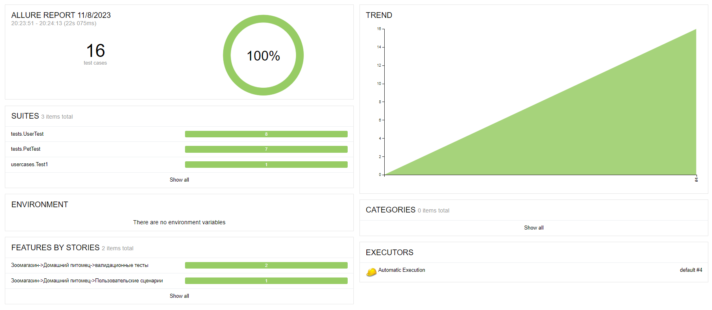
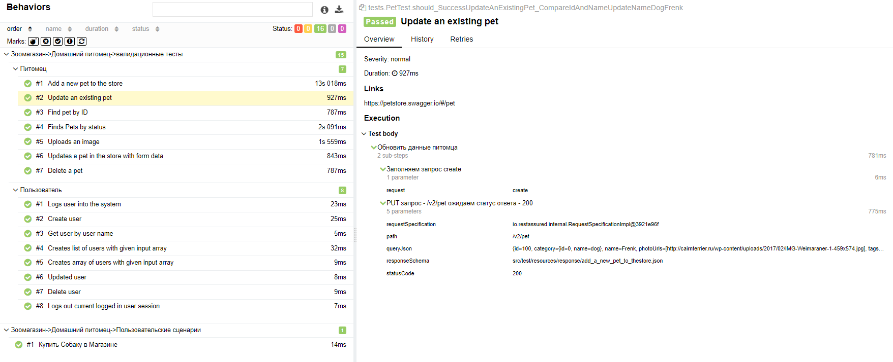

:toc-title: Тестирование Планета.IBS
:author: pfadeev@IBS.ru , Павел Фадеев

= Тестовое задание:

Срок выполнения - 7 дней (само задание делается за 3 дня, но мы отталкиваемся от того что кандидат может иметь стороннюю загрузку, либо немного иной стек).

== Цель

    Напишите проект автотестов для сервиса https://petstore.swagger.io/

1. валидационные тесты на контроллеры (объем определяется исполнителем)
1. пользовательские сценарии (объем определяется исполнителем)

== Условия к заданию:

1. базовый сборщик - gradle (Использую maven он мне роднее)
1. базовый фреймворк запуска тестов -TestNg (использую jUnit5 он круче и не сложнее)
1. взаимодействие с тестируемым сервисом происходит с помощью RestAssured
1. в проекте используется Allure Framework для генерации отчетов
1. автотесты упакованы в Docker с использованием Docker Compose и переменных окружения, которые должны быть описаны в отдельном файле
1. файл README должен содержать подробное описание по работе с проектом (смотреть PDF или лучше через IDE с плагином asciiDoc позволяет легко найти все файлы из README.adoc)
1. все создаваемые записи в сервисе должны удаляться после прогона тестов (в работе, но тесты пока работают последовательно и последний тест чистить работу предыдущих)
1. передача проекта осуществляется через ссылку на git репозиторий с проектом
1. будет плюсом разработка понятного консольного логирования (считаю это не комельфо, все должно быть понятно из отчете, тесты должны быть простыми и консольное логирование нужно для сложных моментов)

== Описание пакетов и классов

1. endpoints - содержит классы с методами настройки запросов (заполнение значениями тел запросов) и хранит данные запроса
1. src/test/java/tests - пакет содержит функциональные тесты по проверке endpoint
1. src/test/java/usercases - пакет содержит функциональные тесты по проверке пользовательских сценариев
1. src/test/java/endpoints - пакет содержит классы по работе с endpoint (PageObject на сервис)
1. Sender - класс который занимается отправкой запросов согласно методу протокола HTTP/HTTPS (GET, POST,PUT, DELETE)
1. Endpoint - класс который хранит необходимую информацию для отправки проверки и настройки запросов (Путь endpoint, заголовки, пути к файлам с телами запросов и схем валидации ответов)

*Класс Sender*

Класс содержит статические методы для отправки CRUD запроса с разной конфигурацией

[source,java]
include::src/test/java/tools/Sender.java[lines=14..]

*Класс Endpoint*

    Содержит информацию о точке сервиса, собирается из XML файлов в которых описываем путь к rest методу Сервиса, параметры заголовка, так же содержит пути к шаблонам тел запросов и пути к json схемам валидации ответов

[source,java]
include::src/test/java/endpoints/Endpoint.java[lines=7..]

*Класс Pet*

    Содержит свойства и методы для управления CRUD питомцами

Свойство в котором храниться информация о endpoint (путь, параметры заголовка, пути к шаблонам запросов и схем валидации ответа)
[source,java]
include::src/test/java/endpoints/Pet.java[lines=24..27]

Свойства для заполнения тела запроса:
[source,java]
include::src/test/java/endpoints/Pet.java[lines=28..36]

Методы:
[source,java]
include::src/test/java/endpoints/Pet.java[lines=37..]

Xml описание bean endpoint свойства endpoint в классе Pet
[source,xml]
include::src/test/resources/endpoints/petstore.xml[lines=9..34]

xml описание bean Pet для теста с положительным результатом
[source,xml]
include::src/test/resources/datapools/pet.xml[lines=9..33]

*Тесты валидации*
[source,java]
include::src/test/java/tests/PetTest.java[lines=26..]

== Запуск тестов

*Собрать docker images*

1. Перейти в корень проекта
1. Запустить команду "docker build -t petstore-tz ."

*Запустить тесты из docker-compose*

1. Перейти в корень проекта
1. Заменить нужными значениями параметры BASE_URL и API_KEY в файле docker-compose.yml
[source,yaml]
include::docker-compose.yml[lines=10..11]

1. Запустить команду "docker-compose up"

== Артефакты проекта

*POM.XML*

[source,xml]
include::pom.xml[lines=4..7]

Свойства проекта

[source,xml]
include::pom.xml[lines=8..14]

Подключённые зависимости к проекту

[source,xml]
include::pom.xml[lines=16..67]

Плагины проекта

[source,xml]
include::pom.xml[lines=69..94]

*DOCKERFILE*

[source,txt]
include::Dockerfile[lines=2..13]

*DOCKER-COMPOSE*

[source,yaml]
include::docker-compose.yml[lines=2..12]

== Отчёт

*Сводный отчет*

*Валидационные тесты endpoints Pet*

*Пользовательские сценарии*

